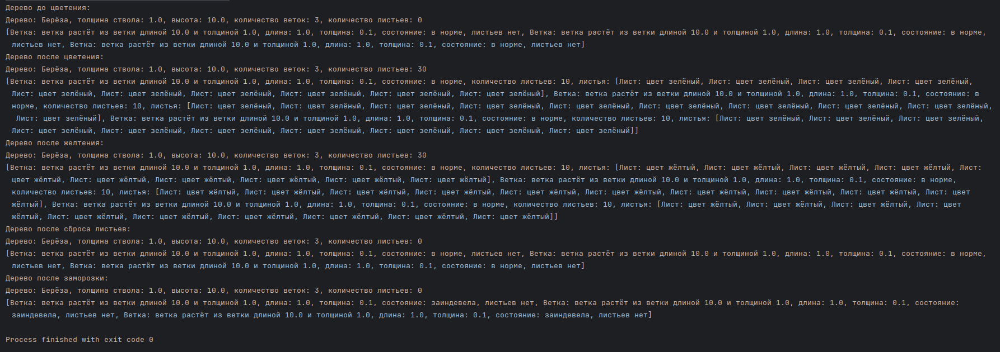

# Вариант 57

(4142 + 14) % 82 + 1 = 57

## Задание

### Общее задание

Создать приложение, удовлетворяющее требованиям, приведенным в задании. Наследование применять только в тех заданиях, в которых это логически обосновано. Аргументировать принадлежность классу каждого создаваемого метода и корректно переопределить для каждого класса методы equals(), hashCode(), toString().

### Задание по варианту

Создать объект класса Дерево, используя классы Лист, Ветка. Методы: зацвести, опасть листьям, покрыться инеем, пожелтеть листьям.

## Листинг кода

### Main.kt

\verbatiminput{./proj/src/main/kotlin/Main.kt}

### Tree.kt

\verbatiminput{./proj/src/main/kotlin/Tree.kt}

### Leaf.kt

\verbatiminput{./proj/src/main/kotlin/Leaf.kt}

### Branch.kt

\verbatiminput{./proj/src/main/kotlin/Branch.kt}

## Результат работы программы

