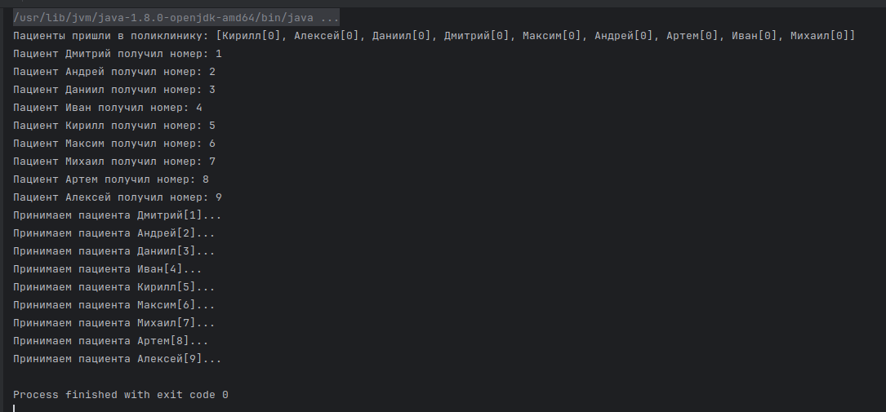

# Вариант 21

(4142 + 14) % 22 + 1 = 21

## Задание

Суть алгоритма поликлиники заключается в том, что при выборе потоком себе номера, он не обращается к общему счетчику, а выбирает наибольший среди тех, что имеются у других потоков. При определении следующей очереди, так же как и в предыдущем алгоритме, ее получает поток с наименьшим номером.

## Листинг кода

### Main.kt

\verbatiminput{./proj/src/main/kotlin/Main.kt}

### Patient.kt

\verbatiminput{./proj/src/main/kotlin/Patient.kt}

### Polyclinic.kt

\verbatiminput{./proj/src/main/kotlin/Polyclinic.kt}

## Результат работы программы

