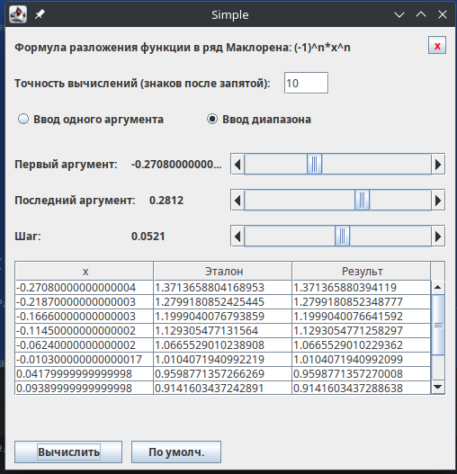
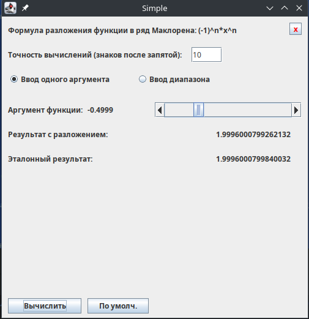
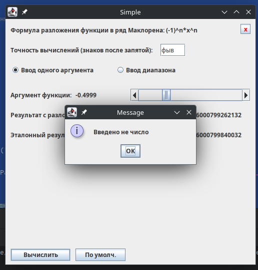

# Варианты

### формула:

(4142 + 14) % 10 + 1 = 7

### Элемент ввода аргумента

(4142 + 14) % 6 + 1 = 5 (**JScrollBar**)

### Элемент ввода точности

(4142 + 14) % 4 + 1 = 1 (**JTextField**)

## Задание

${1 \over (1 + x)} = 1 - x + x^2 - x^3 + x^4 - x^5$

## Листинг кода

### Main.kt

\verbatiminput{./lr4/src/Main.kt}

### MainWindow.kt

\verbatiminput{./lr4/src/MainWindow.kt}

### Calculations.kt

\verbatiminput{./lr4/src/Calculations.kt}

## Результат работы программы

